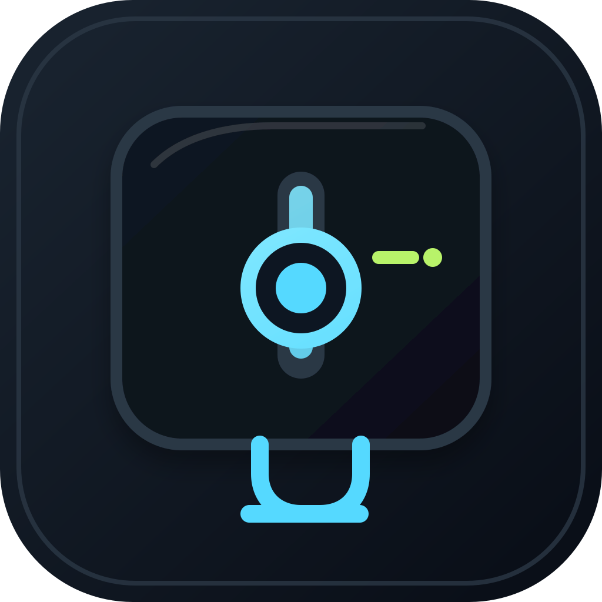
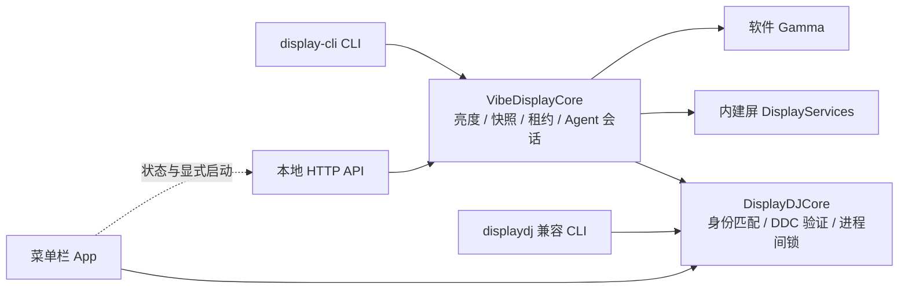

<div align="center">

# DisplayDJ

**你控制显示器，Agent 管理任务节奏。**

A macOS menu bar app, command-line tool, and local API for display control and agent workflows.

`macOS 13+` · `Swift 6` · `Apple Silicon DDC/CI` · `MIT`

</div>

DisplayDJ 将 **DisplayDJ 的菜单栏与外屏硬件引擎**，和 **VibeDisplay 的 CLI、HTTP、保活租约、Agent 生命周期**合并为一个 Swift Package。外屏亮度读写共用同一套实现，并通过进程间锁协调 App、CLI 与后台服务。

这是独立新项目，从 `0.1.0` 开始，仓库命名为 `displaydj`。采用一个仓库统一维护 App、CLI、硬件内核、服务和版本；不导入两个源项目的 Git 历史。GitHub 远端尚未配置；安装包为本机架构、临时签名，未做 Apple 公证。当前验证结果与限制见 [验收记录](docs/VALIDATION.md)。

<p align="center">
  
</p>

DisplayDJ 的视觉锚点是 **DJ Gate（校准通道）**：一条不对称的可恢复通道承载 fader 与状态 cue，而不是通用的显示器或太阳图标。完整尺寸和状态规则见[品牌系统](docs/BRAND.md)。

## 一个工具，三个入口

| 入口 | 适合谁 | 已实现能力 |
| --- | --- | --- |
| **DisplayDJ.app** | 日常桌面操作 | 外屏亮度卡片、滚轮、可选快捷键、别名与排序、断开/重连、Agent 服务状态与显式启动 |
| **display-cli** | 终端、脚本、编程 Agent | 显示器发现、亮度、恢复、断开/重连、保活、任务阶段、诊断、服务管理 |
| **本地 HTTP API** | 自动化与工具集成 | Bearer token 鉴权、显示器与亮度、租约、会话与心跳 |

另保留 `displaydj` 兼容命令，原有 `get brightness` / `set brightness` 脚本可以继续使用。它保留旧 JSON schema 与退出码，不与新 CLI 的契约混用。

## 开始使用

需要 macOS 13+、Swift 6.0+ 工具链和 Python 3（仅打包与烟雾测试）。首次构建需要获取 Apple 的 `swift-argument-parser`；主 CLI、硬件内核和 HTTP 层本身不使用该依赖。

```bash
swift build
.build/debug/display-cli doctor --json
.build/debug/display-cli displays --json

# 生成包含两套 CLI 的菜单栏 App
bash scripts/build-app.sh
open '.build/DisplayDJ.app'
```

App 的亮度卡片目前面向外接显示器。内建显示器和软件 Gamma 控制通过主 CLI / HTTP 提供。

```bash
# 从 displays 输出复制目标 UUID；亮度值是 0…1 或显式百分比
.build/debug/display-cli brightness set 60% --display uuid:<UUID>
.build/debug/display-cli brightness set +5% --display uuid:<UUID>
.build/debug/display-cli brightness restore

# 只在一个命令运行期间保持唤醒
.build/debug/display-cli keepawake run -- make test

# 把开始、运行、完成与恢复交给任务生命周期
# 默认配置会改变显示器亮度，先检查 config show
.build/debug/display-cli config show
.build/debug/display-cli agent run --label 'test suite' -- make test
```

需要复制 CLI 时，可以将 `.build/debug/display-cli` 放入你自己的 PATH 目录。App 中也包含 `Contents/MacOS/display-cli` 和兼容命令 `displaydj`。

## 从桌面到 Agent



菜单栏适合直接操作；CLI 适合脚本；常驻服务承载 Gamma、租约到期和会话回收。启动 App 不会自动安装登录项；点击“启动本地服务”只启动当前用户的后台服务。需要登录后自动启动时，显式运行 `display-cli daemon install`。

## 可以依赖什么

- **身份匹配**：DDC 使用 DisplayDJ 的服务与显示器身份关联，不再按两份枚举列表的位置配对。旧 `ddcServiceIndex` 配置会被拒绝，避免误控另一块屏幕。
- **写后验证**：DDC 写入前读取基线，写入后核验读回值；失败尝试恢复并报告结果，不用请求值冒充读回值。
- **跨进程协调**：App、主 CLI、兼容 CLI 的 DDC 操作共用本机用户锁。进程退出自动释放；等待超时返回 busy，不强行争用硬件。
- **恢复可重试**：成功恢复后才移除恢复点；断开的显示器或失败的恢复会保留快照。
- **本地接口**：HTTP 仅在 loopback 接口工作，默认要求令牌。配置与令牌默认在 `~/.displaydj/`。
- **断开保护**：拒绝批量断开、镜像屏断开和最后一块在线显示器断开。

恢复不等于绝对保证。SIGKILL 无法执行清理；快照可用于之后显式恢复。DDC/私有系统 API 可能卡住或因设备、线缆、macOS 版本变化而不可用。Gamma 是软件变暗，需要进程常驻，不能冒充硬件背光调节。

## 兼容范围

| 能力 | 当前边界 |
| --- | --- |
| Apple Silicon 外屏 DDC | 共用 DisplayDJ 读写实现；本次完成只读探测，未进行真实亮度写入验收 |
| 内建屏亮度 | 主 CLI / HTTP 的 DisplayServices 后端；本次未做真实写入验收 |
| Intel 外屏 DDC | 未实现生产读写路径；可能使用软件 Gamma |
| 显示器断开 / 重连 | 依赖私有 API；缺失时明确失败；本次未改变真实显示拓扑 |
| App 与 Agent 同时调光 | 硬件操作会串行，但 Agent 结束仍可能恢复之前的快照；没有“手动操作优先”的所有权仲裁 |
| 分发 | 本地架构 ZIP 与 SHA-256；尚未验证双架构、Developer ID 签名或公证 |

## 开发与打包

```bash
swift test
python3 scripts/smoke.py
bash scripts/package.sh
```

测试覆盖两套原有测试及整合边界；烟雾测试使用独立状态目录，只读探测真实屏幕并验证服务鉴权与退出。`package.sh` 输出 `outputs/displaydj-<版本>-macos-<架构>.zip` 与校验和。它不上传 GitHub，也不修改 Applications。

- [CLI / HTTP 参考](docs/API.md)
- [Agent 接入](docs/AGENT-INTEGRATION.md)
- [架构与迁移](docs/ARCHITECTURE.md)
- [来源与许可](docs/PROVENANCE.md)
- [验证结果](docs/VALIDATION.md)
- [Dell 硬件检查](docs/HARDWARE.md)
- [后续里程碑](docs/ROADMAP.md)

## 许可与致谢

MIT，完整许可见 [LICENSE](LICENSE) 与 [LICENSES](LICENSES)。本项目包含 DisplayDJ 的派生代码，因此保留 **MonitorControl Contributors** 的版权与许可声明。DisplayDJ 之外的 VibeDisplay 来源单独记录，不能再将合并后的整个项目描述为“未派生自 MonitorControl”。

维护者 GitHub：[hellowmq](https://github.com/hellowmq)。已选定单仓库名 `displaydj`；远端尚未创建或配置，不展示未发布的仓库链接。
