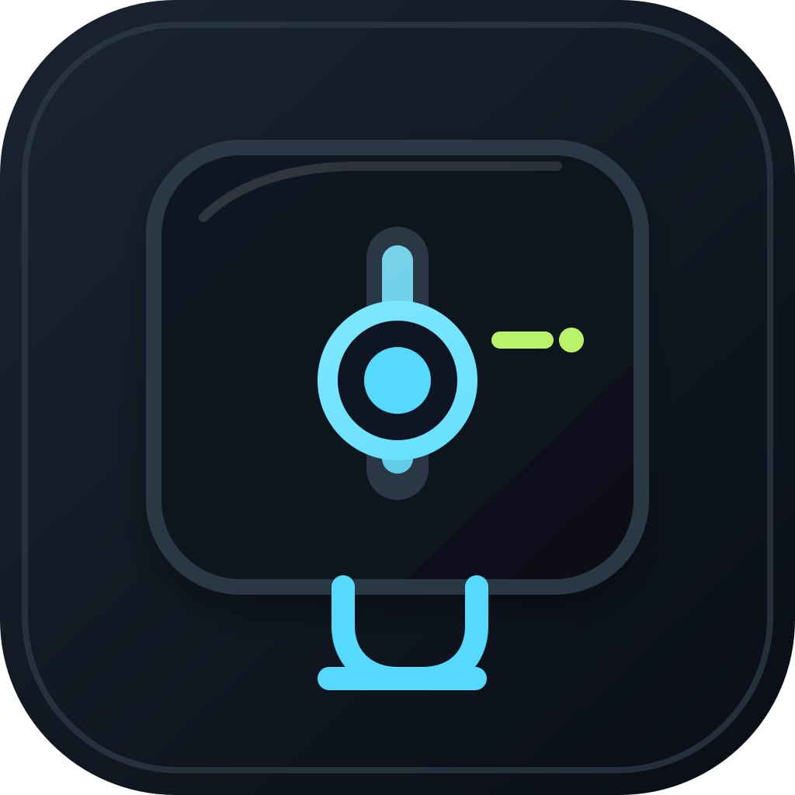

<div align="center">

# DisplayDJ

**调亮度、切换模式，或不用拔线就让显示器从 Mac 桌面中下线。**

面向日常控制与自动化的 macOS 菜单栏 App 和独立命令行工具。

[English](README.md) | **简体中文**

[](https://github.com/hellowmq/displaydj/actions/workflows/ci.yml)

`v1.0.0` · `macOS 13+ target` · `Swift 6` · `Apple Silicon DDC/CI` · `MIT`

[下载 v1.0.0](https://github.com/hellowmq/displaydj/releases/tag/v1.0.0) · [快速开始](#快速开始) · [CLI / HTTP 参考](docs/API.md)

</div>

DisplayDJ 把“连接状态”也变成显示器控制的一部分，而不只是让你去拔线。主动断开一台显示器后，它会从 macOS 桌面布局中消失，窗口移到仍在线的屏幕；需要时再从菜单栏或 `display-cli` 重新连接。这不同于把屏幕调暗或发送 DDC 休眠命令。

同一个 App 还可以控制亮度、对比度、显示器音量、显示模式和命名亮度预设。独立 CLI 无需打开 App 或常驻服务即可工作；只有需要持续状态的自动化任务才需要可选的本地 HTTP 服务。

<p align="center">
  
</p>

## 为什么选择 DisplayDJ

- **不用拔线也能断开显示器**：让单台显示器退出 macOS 桌面，需要时再重新连接。DisplayDJ 会保存目标、核验拓扑变化，并拒绝可能影响多台屏幕、镜像组或最后一块在线屏幕的危险请求。
- **不只调亮度**：内建屏使用原生背光控制；支持的外屏可通过 DDC 调节亮度、对比度与音量；另有明确启用的逐屏 Gamma、显示模式、亮度预设、快捷键和可选的同百分点亮度同步。
- **按场景选择入口**：日常使用菜单栏，脚本直接运行 `display-cli`；只有需要持续状态时，才启动受令牌保护、仅监听本机 loopback 的 HTTP 服务。
- **每次写入都可验证**：DDC 操作使用稳定显示器身份、写前基线、独立回读、失败恢复与跨进程锁，不把“已请求的值”当成成功结果。

主动断开依赖 macOS 私有 API，也会受到系统与硬件环境影响。DisplayDJ 只在系统存在所需入口时提供操作；实测范围见[兼容范围](#兼容范围)。

## 使用方式

| 入口 | 适合谁 | 已实现能力 |
| --- | --- | --- |
| **DisplayDJ.app** | 日常桌面操作 | 亮度卡片、滚轮、可选快捷键、别名与排序、断开/重连；显示设置窗口提供每屏 Gamma、模式、外屏音量/对比度、亮度预设与可选硬件亮度同步 |
| **display-cli** | 终端、脚本、编程 Agent | 显示器发现、亮度、恢复、断开/重连、保活、任务阶段、诊断、服务管理；无需启动 App 或后台服务 |
| **可选本地服务** | 需要 HTTP 接入或跨命令持续状态的自动化 | Bearer token 鉴权、Gamma、保活租约、会话与心跳；通过 CLI 启停 |

另保留 `displaydj` 兼容命令，原有 `get brightness` / `set brightness` 脚本可以继续使用。它保留旧 JSON schema 与退出码，不与新 CLI 的契约混用。

## 从 App 或 CLI 主动断开显示器

当操作可用且安全时，每张在线显示器卡片都提供断开按钮。由 DisplayDJ 断开的屏幕会保留在“已断开的显示器”区域，并提供“重新连接”入口。CLI 提供相同流程和适合脚本处理的结构化输出：

```bash
# 先查找目标显示器的稳定 UUID
.build/debug/display-cli displays --json

# 让单台显示器退出 macOS 桌面，之后再重新连接
.build/debug/display-cli disconnect --display uuid:<UUID>
.build/debug/display-cli connect --display uuid:<UUID>
```

断开操作一次只接受一个稳定目标。DisplayDJ 不会断开镜像屏或最后一块在线屏幕；如果拓扑核验失败，重连记录仍会保留，便于之后恢复目标显示器。

## 更多显示控制

DisplayDJ 提供外屏对比度与音量、系统已有显示模式的选择，以及命名亮度预设。主 CLI 和 HTTP 均提供这些功能；菜单栏可打开“显示设置与预设”窗口。相关写入支持 `--dry-run` 预演。v1.0.0 在一台 HP D27k 的当前连接上完成 DDC 亮度、对比度的小幅写入、独立回读和恢复；这项结果不能推广到其他显示器或连接方式。

```bash
# 单独使用 CLI，不需要先打开菜单栏 App
.build/debug/display-cli volume get --display external --json
.build/debug/display-cli contrast set 60% --display uuid:<UUID> --dry-run --json
.build/debug/display-cli modes list --display main --json
.build/debug/display-cli modes set <MODE_ID> --display uuid:<UUID> --dry-run --json

# 保存当前亮度，预演后应用；Gamma 预设实际应用需要本地服务
.build/debug/display-cli profile save work
.build/debug/display-cli profile apply work --dry-run --json
.build/debug/display-cli profile apply work

# 构建并打开本地 App 的显示设置窗口
./script/build_and_run.sh --tools
```

## 快速开始

### 下载 App

从 [v1.0.0 Release](https://github.com/hellowmq/displaydj/releases/tag/v1.0.0) 下载 arm64 ZIP 或 DMG。安装包同时包含 `DisplayDJ.app`、独立的 `display-cli` 和兼容旧脚本的 `displaydj` 命令。

当前下载包仅支持 Apple Silicon，采用 ad-hoc 签名，尚未经过 Developer ID 签名和 Apple 公证，因此 macOS 可能阻止首次启动。可在 Finder 中按住 Control 点击 DisplayDJ 并选择“打开”，或前往“系统设置 → 隐私与安全性”允许打开。全局快捷键还需要辅助功能权限；若授权后没有立即生效，请退出并重新打开 DisplayDJ。完整安装说明与兼容边界见[发布说明](docs/RELEASE-NOTES-1.0.0.md)。

### 从源码构建

需要 macOS 13+、Swift 6.0+ 工具链和 Python 3（仅打包与烟雾测试）。首次构建需要获取 Apple 的 `swift-argument-parser`；主 CLI、硬件内核和 HTTP 层本身不使用该依赖。

#### 菜单栏 App

```bash
swift build
bash scripts/build-app.sh
open '.build/DisplayDJ.app'
```

App 的亮度卡片支持外接 DDC 与内建屏原生背光。设置窗口还提供逐屏 Gamma 软件调光：打开窗口或切屏时自动读取，松开滑块即应用；服务未运行时需由用户点击“启用软件调光”。快捷键可选择已选中的显示器或鼠标所在显示器，多屏硬件亮度同步默认关闭。App 不会自动安装登录项。

#### 独立 CLI

运行 `swift build --product display-cli` 后即可单独使用 CLI，无需打开 App 或启动后台服务；也可以将可执行文件放入自己的 PATH 目录。App 包内同样包含 `Contents/MacOS/display-cli` 和兼容命令 `displaydj`。

```bash
.build/debug/display-cli doctor --json
.build/debug/display-cli displays --json

# 从 displays 输出复制目标 UUID；亮度值是 0…1 或显式百分比
.build/debug/display-cli brightness set 60% --display uuid:<UUID>
.build/debug/display-cli brightness set +5% --display uuid:<UUID>
.build/debug/display-cli brightness restore

# 只在一个命令运行期间保持唤醒
.build/debug/display-cli keepawake run -- make test

# 把开始、运行、完成与恢复交给任务生命周期
# 默认配置会改变显示器亮度，先检查 config show
.build/debug/display-cli config show
.build/debug/display-cli agent run --label 'test suite' -- make test
```

#### 可选后台服务

普通 CLI 操作不需要服务。HTTP 接入、命令退出后仍需保持的 Gamma 调光与租约、以及跨命令管理 Agent 会话时，再启动本地服务。设置窗口也有显式启动按钮；结束时可用 CLI 停止。只有明确需要登录后自动启动时才安装登录项。

```bash
.build/debug/display-cli serve --detach
.build/debug/display-cli daemon status
.build/debug/display-cli daemon stop

# 可选：登录后自动启动；关闭自动启动请运行 daemon uninstall
.build/debug/display-cli daemon install
.build/debug/display-cli daemon uninstall
```

只有需要持续状态或 HTTP 接入时才运行后台服务；App 不会自动安装登录项或启动服务。若已通过 `daemon install` 安装登录项，`daemon stop` 后服务会重新启动；使用 `daemon uninstall` 关闭自动启动。模块关系与迁移说明见[架构文档](docs/ARCHITECTURE.md)。

## 可以依赖什么

- **身份匹配**：DDC 使用 DisplayDJ 的服务与显示器身份关联，不再按两份枚举列表的位置配对。旧 `ddcServiceIndex` 配置会被拒绝，避免误控另一块屏幕。
- **写后验证**：DDC 写入前读取基线，写入后核验读回值；失败尝试恢复并报告结果，不用请求值冒充读回值。
- **跨进程协调**：App、主 CLI、兼容 CLI 的 DDC 操作共用本机用户锁。进程退出自动释放；等待超时返回 busy，不强行争用硬件。
- **恢复可重试**：成功恢复后才移除恢复点；断开的显示器或失败的恢复会保留快照。
- **本地接口**：HTTP 仅在 loopback 接口工作，默认要求令牌。配置与令牌默认在 `~/.displaydj/`。
- **断开保护**：拒绝批量断开、镜像屏断开和最后一块在线显示器断开。

恢复不等于绝对保证。SIGKILL 无法执行清理；快照可用于之后显式恢复。DDC/私有系统 API 可能卡住或因设备、线缆、macOS 版本变化而不可用。Gamma 是软件变暗，需要进程常驻，不能冒充硬件背光调节。

## 兼容范围

| 能力 | 当前边界 |
| --- | --- |
| Apple Silicon 外屏 DDC | 共用 DisplayDJ 读写实现；v1.0.0 在 HP D27k 当前连接验证了亮度和对比度写入、回读与恢复；该屏音量不支持 DDC 调节 |
| 内建屏亮度 | 主 CLI / HTTP 的 DisplayServices 后端；v1.0.0 完成小幅写入、独立回读与恢复 |
| Intel 外屏 DDC | 未实现生产读写路径；可能使用软件 Gamma |
| macOS 13/14 | 构建目标从 13 起；v1.0.0 只在本机 macOS 27 实测，尚无最低版本的安装与硬件验收 |
| 显示器断开 / 重连 | 依赖私有 API；v1.0.0 在此前 Dell 当前连接上完成断开、重连与拓扑回读，其他设备尚无此证据 |
| App 与 Agent 同时调光 | 硬件操作会串行，但 Agent 结束仍可能恢复之前的快照；没有“手动操作优先”的所有权仲裁 |
| 分发 | arm64 ZIP、DMG 与 SHA-256；ad-hoc 签名且未公证，尚未验证双架构或 Developer ID 签名 |

## 开发与打包

GitHub Actions 在 `macos-15` 上对每次 push 和 pull request 执行与本地相同的核心检查：

```bash
swift build
swift test
python3 scripts/smoke.py
bash scripts/build-app.sh

# 可选：生成本机架构、ad-hoc 签名的 ZIP 或 DMG
bash scripts/package.sh
bash scripts/package-dmg.sh
```

测试覆盖两套原有测试及整合边界；烟雾测试使用独立状态目录，只读探测真实屏幕并验证服务鉴权与退出。`package.sh` 和 `package-dmg.sh` 默认输出 `outputs/displaydj-<版本>-macos-<架构>.*` 与校验和；已有同名文件时会拒绝覆盖，可设置 `DISPLAYDJ_OUTPUT_DIR` 选择新目录。它们不上传 GitHub，也不修改 Applications。

- [CLI / HTTP 参考](docs/API.md)
- [Agent 接入](docs/AGENT-INTEGRATION.md)
- [架构与迁移](docs/ARCHITECTURE.md)
- [来源与许可](docs/PROVENANCE.md)
- [验证结果](docs/VALIDATION.md)
- [1.0.0 发布说明](docs/RELEASE-NOTES-1.0.0.md)
- [1.0 验收清单](docs/RELEASE-1.0-CHECKLIST.md)
- [设备分阶段验证](docs/DEVICE-VALIDATION.md)
- [双屏界面验收步骤](docs/GUI-ACCEPTANCE-1.0.md)
- [Dell D2720DS 探测记录](docs/HARDWARE.md)
- [后续里程碑](docs/ROADMAP.md)

## 许可与致谢

MIT，完整许可见 [LICENSE](LICENSE) 与 [LICENSES](LICENSES)。部分实现派生自 MonitorControl，项目保留 **MonitorControl Contributors** 的版权与许可声明；各模块的来源见[来源与许可](docs/PROVENANCE.md)。

维护者 GitHub：[@hellowmq](https://github.com/hellowmq)。项目仓库：[hellowmq/displaydj](https://github.com/hellowmq/displaydj)。
